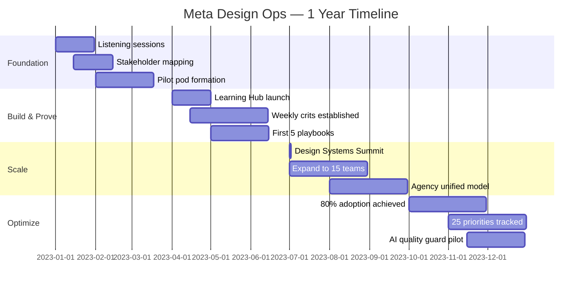

# Meta Case Study Timeline
**Visual Diagram for Slides 4-10**

---

## Timeline Overview (1 Year)

```
MONTH 1-3          MONTH 4-6          MONTH 7-9          MONTH 10-12
   │                  │                  │                  │
   ▼                  ▼                  ▼                  ▼
┌─────────┐      ┌─────────┐      ┌─────────┐      ┌─────────────┐
│ LISTEN  │      │  BUILD  │      │  SCALE  │      │   MEASURE   │
│ & ALIGN │      │ & PROVE │      │& ENABLE │      │ & OPTIMIZE  │
└─────────┘      └─────────┘      └─────────┘      └─────────────┘
```

---

## Detailed Quarter-by-Quarter Breakdown

### Q1: Foundation & Alignment
```
━━━━━━━━━━━━━━━━━━━━━━━━━━━━━━━━━━━━━━━━━━━━━━━━━━━━━━━━━━━
                    Q1 — FOUNDATION
━━━━━━━━━━━━━━━━━━━━━━━━━━━━━━━━━━━━━━━━━━━━━━━━━━━━━━━━━━━

📊 BASELINE METRICS
   • Blueprint adoption: 15%
   • Agency: Output-focused, no measurement
   • Creator flows: High friction

🎯 KEY ACTIVITIES
   • Listening sessions with designers, PMs, engineers
   • Stakeholder mapping (10+ functions)
   • Define success metrics
   • Pilot pod formation (3 teams)

✅ MILESTONES
   ✓ Ouroboros framework adopted
   ✓ 3 pilot teams onboarded to Blueprint
   ✓ Agency measurement framework defined
━━━━━━━━━━━━━━━━━━━━━━━━━━━━━━━━━━━━━━━━━━━━━━━━━━━━━━━━━━━
```

### Q2: Build & Prove
```
━━━━━━━━━━━━━━━━━━━━━━━━━━━━━━━━━━━━━━━━━━━━━━━━━━━━━━━━━━━
                  Q2 — BUILD & PROVE
━━━━━━━━━━━━━━━━━━━━━━━━━━━━━━━━━━━━━━━━━━━━━━━━━━━━━━━━━━━

🛠️ KEY ACTIVITIES
   • Launch Blueprint Learning Hub
   • Establish weekly cross-discipline crits
   • Create excellence checkpoints
   • Build advocacy network (10 initial champions)
   • Author first 5 playbooks

📈 EARLY WINS
   • Pilot teams: 40% adoption
   • 10% faster shipping in pilot
   • First Agency playbook in use

✅ MILESTONES
   ✓ Learning Hub: 250+ video views
   ✓ Advocacy network: 10 champions
   ✓ 5 playbooks published
━━━━━━━━━━━━━━━━━━━━━━━━━━━━━━━━━━━━━━━━━━━━━━━━━━━━━━━━━━━
```

### Q3: Scale & Enable
```
━━━━━━━━━━━━━━━━━━━━━━━━━━━━━━━━━━━━━━━━━━━━━━━━━━━━━━━━━━━
                  Q3 — SCALE & ENABLE
━━━━━━━━━━━━━━━━━━━━━━━━━━━━━━━━━━━━━━━━━━━━━━━━━━━━━━━━━━━

🚀 KEY ACTIVITIES
   • Design Systems Summit (400+ attendees)
   • Expand pods to 15 product teams
   • Launch monthly growth syncs
   • Creator flow optimization project
   • Agency unified operating model

📈 MOMENTUM
   • Blueprint adoption: 60%
   • 15% faster shipping
   • 25% design debt reduction
   • 30+ advocacy champions

✅ MILESTONES
   ✓ Summit: 400+ attendees
   ✓ 10 playbooks total
   ✓ 45+ Agency unified
━━━━━━━━━━━━━━━━━━━━━━━━━━━━━━━━━━━━━━━━━━━━━━━━━━━━━━━━━━━
```

### Q4: Measure & Optimize
```
━━━━━━━━━━━━━━━━━━━━━━━━━━━━━━━━━━━━━━━━━━━━━━━━━━━━━━━━━━━
                Q4 — MEASURE & OPTIMIZE
━━━━━━━━━━━━━━━━━━━━━━━━━━━━━━━━━━━━━━━━━━━━━━━━━━━━━━━━━━━

📊 FINAL METRICS
   • Blueprint adoption: 80% ⬆️
   • Shipping velocity: +20% ⬆️
   • Design debt: -35% ⬇️
   • Learning Hub: 1,000+ views ⬆️

🎯 KEY ACTIVITIES
   • Quarterly retrospective & iteration
   • Product priorities tracker (25 priorities → growth metrics)
   • Creator retention improvements visible
   • AI quality guard pilot

✅ MILESTONES
   ✓ 80% Blueprint adoption achieved
   ✓ 25 product priorities tracked to growth metrics
   ✓ 3B+ users supported
━━━━━━━━━━━━━━━━━━━━━━━━━━━━━━━━━━━━━━━━━━━━━━━━━━━━━━━━━━━
```

---

## Three Workstreams (Parallel)

### Horizontal View
```
┌─────────────────────────────────────────────────────────────────────┐
│                                                                       │
│  THE AGENCY                                                           │
│  ────────────────────────────────────────────────────────────────   │
│  Q1: Baseline measurement │ Q2: Playbooks │ Q3: Unified │ Q4: 45+   │
│                                                                       │
├─────────────────────────────────────────────────────────────────────┤
│                                                                       │
│  BLUEPRINT DPA                                                        │
│  ────────────────────────────────────────────────────────────────   │
│  Q1: 15% → pilot │ Q2: Learning Hub │ Q3: 60% │ Q4: 80% adoption   │
│                                                                       │
├─────────────────────────────────────────────────────────────────────┤
│                                                                       │
│  CREATORS & PUBLISHERS                                                │
│  ────────────────────────────────────────────────────────────────   │
│  Q1: Map friction │ Q2: Pod alignment │ Q3: Flow fixes │ Q4: Impact │
│                                                                       │
└─────────────────────────────────────────────────────────────────────┘
         Q1                    Q2                   Q3             Q4
```

---

## Adoption Curve Visualization

```
Blueprint Design System Adoption

 80% │                                                        ████
     │                                                    ████
     │                                                ████
 60% │                                            ████
     │                                        ████
     │                                    ████
 40% │                          ████████
     │                      ████
     │                  ████
 20% │              ████
     │          ████
     │      ████
 15% │  ████ (BASELINE)
     │
     └───────────────────────────────────────────────────────────────
        Q1        Q2        Q3        Q4

     Pilot    Learning   Summit    Full
     Teams      Hub       & Scale   Adoption
```

---

## Key Metrics Dashboard (End of Year)

```
┌─────────────────────────────────────────────────────────────────┐
│                     META — YEAR 1 IMPACT                        │
├─────────────────────────────────────────────────────────────────┤
│                                                                 │
│  📊 BLUEPRINT ADOPTION                 🚀 SHIPPING VELOCITY     │
│     15% → 80%                             +20% faster          │
│     ▓▓▓▓▓▓▓▓░░░░                          ▓▓▓▓▓▓▓▓▓▓          │
│                                                                 │
│  📉 DESIGN DEBT                        👥 AGENCY UNIFIED       │
│     -35% reduction                        45+ people           │
│     ▓▓▓▓▓▓▓░░░░░                          ▓▓▓▓▓▓▓▓▓▓          │
│                                                                 │
│  📚 LEARNING HUB                       🎯 PRODUCT PRIORITIES   │
│     1,000+ video views                    25 tracked (Q1 '24) │
│     ▓▓▓▓▓▓▓▓▓▓                            ▓▓▓▓▓▓▓▓▓▓          │
│                                                                 │
│  🌍 USERS SUPPORTED                    📖 PLAYBOOKS CREATED    │
│     3+ Billion                            10 published         │
│     ▓▓▓▓▓▓▓▓▓▓                            ▓▓▓▓▓▓▓▓▓▓          │
│                                                                 │
└─────────────────────────────────────────────────────────────────┘
```

---

## Mermaid Gantt Chart



---

## Slide Layout Recommendations

**Slide 4 (Executive Summary):**
- Left: Logo + horizontal timeline bar (12 months)
- Right: Bullet summary box with key metrics
- Color-code the timeline by quarter

**Slide 6 (Problem & Challenge):**
- 3-column layout showing Agency | Blueprint | Creators
- Use different accent colors for each workstream
- Show baseline → target metrics for each

**Slide 10 (Outcomes & Impact):**
- Metric dashboard with icons (use the dashboard design above)
- Large numbers, visual progress bars
- Color-code by category (adoption, velocity, quality, reach)

---

**Export Recommendations:**
- Timeline: Create in Figma or PowerPoint with animation (quarters appearing sequentially)
- Adoption curve: Use chart tool (Excel, Google Sheets) or vector graphics
- Dashboard: Design in Figma with large, readable metrics
