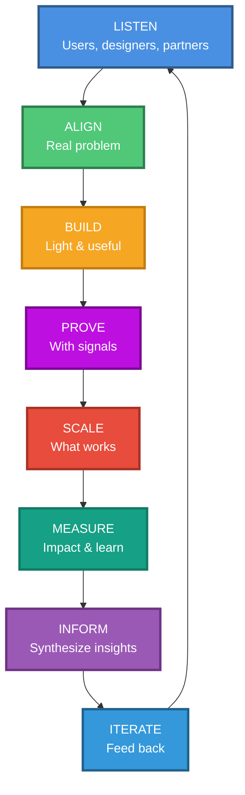

# The Ouroboros Loop — Visual Diagram
**Slide 2: Philosophy**

---

## Visual Concept

A circular loop representing continuous iteration, with 8 stages connected in a cycle. The snake eating its tail symbolizes the self-reinforcing nature of the process.

---

## ASCII Representation

```
                    ┌─────────────┐
                    │   LISTEN    │
                    │  To users,  │
                    │  designers, │
                    │  partners   │
                    └──────┬──────┘
                           │
                           ▼
        ┌───────────────────────────────────┐
        │                                   │
        │         ITERATE                   ALIGN
        │       Feed learnings           On real problem
        │       back to start            & constraints
        │                                   │
        └────────────────┬──────────────────┘
                         │                  │
                         ▼                  ▼
                 ┌──────────────┐   ┌──────────────┐
                 │   INFORM     │   │    BUILD     │
                 │  Synthesize  │   │ Light, useful│
                 │   insights   │   │   solution   │
                 └──────┬───────┘   └──────┬───────┘
                        │                  │
                        ▼                  ▼
                 ┌──────────────┐   ┌──────────────┐
                 │   MEASURE    │   │    PROVE     │
                 │    Impact    │   │ With signals │
                 │   & learn    │   │  & metrics   │
                 └──────┬───────┘   └──────┬───────┘
                        │                  │
                        └────────┬─────────┘
                                 │
                                 ▼
                         ┌──────────────┐
                         │    SCALE     │
                         │  What works  │
                         └──────────────┘
```

---

## Circular Flow Diagram (Mermaid)



---

## Slide Layout Description

**Left Side (60% of slide):**
Large circular diagram with the Ouroboros loop, showing:
- 8 stages in a continuous circle
- Arrows connecting each stage
- Color-coded stages (each in a different accent color)
- Optional: Stylized snake or circular arrow motif

**Right Side (40% of slide):**
Three Pillars in large, bold type:

```
━━━━━━━━━━━━━━━━━━━━━━━━━━━━
        THREE PILLARS
━━━━━━━━━━━━━━━━━━━━━━━━━━━━

1️⃣  PEOPLE-FIRST CLARITY
    Make sure people can do
    their best work

2️⃣  TRUST, PRIVACY, SAFETY
    Non-negotiable at
    product scale

3️⃣  CRAFT AT VELOCITY
    Move fast without
    sacrificing quality
━━━━━━━━━━━━━━━━━━━━━━━━━━━━
```

**Footer:**
Small metrics callouts:
- ⏱️  Faster time-to-decision
- 📊  Higher confidence in choices
- 🛡️  Quality guardrails at scale

---

## Visual Style Recommendations

**Colors:**
- Listen: Blue (#4A90E2) — Empathy, understanding
- Align: Green (#50C878) — Agreement, clarity
- Build: Orange (#F5A623) — Creation, energy
- Prove: Purple (#BD10E0) — Validation, insight
- Scale: Red (#E74C3C) — Growth, expansion
- Measure: Teal (#16A085) — Data, analysis
- Inform: Violet (#9B59B6) — Knowledge, synthesis
- Iterate: Light Blue (#3498DB) — Evolution, improvement

**Typography:**
- Stage names: Bold, sans-serif (e.g., Inter Bold, SF Pro Display Bold)
- Descriptions: Light, readable (e.g., Inter Regular)
- Three Pillars: Extra bold, large (48-60pt)

**Icons/Illustrations:**
- Consider adding small icons to each stage:
  - Listen: Ear or sound wave
  - Align: Puzzle pieces
  - Build: Hammer or wrench
  - Prove: Chart or checkmark
  - Scale: Growth arrow
  - Measure: Ruler or metrics
  - Inform: Lightbulb
  - Iterate: Circular arrows

---

## Animation Suggestions (for digital presentation)

1. **Enter:** Loop appears as a whole (fade in)
2. **Emphasis:** Each stage highlights in sequence as you mention it
3. **Continuous:** Subtle animation showing the circular flow (optional pulsing glow traveling around the loop)
4. **Pillars:** Each pillar appears as you talk about it (staggered fade-in)

---

## Accessibility Notes

- Ensure sufficient color contrast for each stage label
- Use patterns or textures in addition to color for stage differentiation
- Include alt text: "Circular diagram showing 8-stage Ouroboros loop: Listen, Align, Build, Prove, Scale, Measure, Inform, Iterate"
- Font size for stage names should be at least 24pt

---

**File Format Recommendations:**
- Vector format (SVG, Adobe Illustrator, Figma) for scalability
- Export as PNG at 2x resolution for presentations
- Keep editable source file for future iterations
