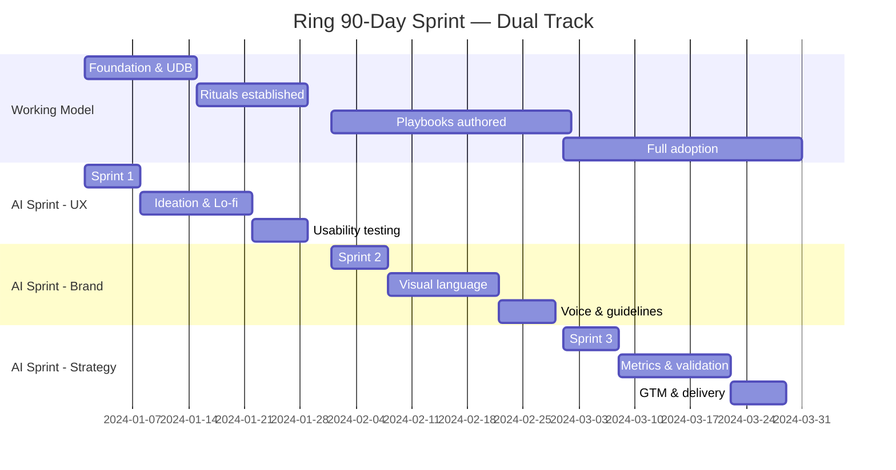

# Ring 90-Day Sprint Timeline
**Visual Diagram for Slides 12-19**

---

## 90-Day Overview: Dual Track

```
┌────────────────────────────────────────────────────────────────────┐
│                     RING 90-DAY SPRINT                             │
│                                                                    │
│  TRACK 1: UX WORKING MODEL                                        │
│  ════════════════════════════════════════════════════════════════ │
│  │         │         │         │         │         │         │    │
│  Week 0   Week 2    Week 4    Week 6    Week 8    Week 10  Week 12│
│  Setup    UDB      Rituals    Pods      Playbooks  Scale    Review│
│                                                                    │
│  TRACK 2: AI AGENT SPRINT (ROGER)                                 │
│  ════════════════════════════════════════════════════════════════ │
│  │                │                │                │              │
│  Week 0-4        Week 4-8         Week 8-12        Week 12        │
│  SPRINT 1: UX    SPRINT 2: Brand  SPRINT 3: Strat  DELIVERY      │
│                                                                    │
└────────────────────────────────────────────────────────────────────┘
```

---

## Detailed Week-by-Week Timeline

### Week 0-2: Foundation
```
━━━━━━━━━━━━━━━━━━━━━━━━━━━━━━━━━━━━━━━━━━━━━━━━━━━━━━━━━━━
                    WEEK 0-2 — FOUNDATION
━━━━━━━━━━━━━━━━━━━━━━━━━━━━━━━━━━━━━━━━━━━━━━━━━━━━━━━━━━━

🎯 WORKING MODEL
   • Stakeholder listening (Design, UXR, Content, Eng, Brand)
   • Define RASCI framework
   • Draft Unified Design Brief (UDB) template
   • Set up Confluence wiki structure

🤖 AI SPRINT (ROGER)
   • Founder kickoff & alignment
   • Define sprint lanes: UX, Brand, Strategy
   • Assemble cross-functional pods
   • Set success metrics

✅ MILESTONES
   ✓ UDB template v1
   ✓ RASCI draft
   ✓ Sprint 1 (UX) kicked off
━━━━━━━━━━━━━━━━━━━━━━━━━━━━━━━━━━━━━━━━━━━━━━━━━━━━━━━━━━━
```

### Week 3-4: Build Rituals + Sprint 1 (UX)
```
━━━━━━━━━━━━━━━━━━━━━━━━━━━━━━━━━━━━━━━━━━━━━━━━━━━━━━━━━━━
                 WEEK 3-4 — BUILD & EXECUTE
━━━━━━━━━━━━━━━━━━━━━━━━━━━━━━━━━━━━━━━━━━━━━━━━━━━━━━━━━━━

🎯 WORKING MODEL
   • Launch weekly cross-pod crits
   • Establish bi-weekly leadership reviews
   • Pilot UDB with 2 projects
   • Sprint planning ritual established

🤖 AI SPRINT (ROGER) — SPRINT 1: UX
   • Ideation workshops (Week 3)
   • Low-fidelity prototyping (Week 3)
   • Usability testing round 1 (Week 4)
   • Iterate based on findings (Week 4)

✅ MILESTONES
   ✓ First crit held (100% attendance)
   ✓ First leadership review (92% completion)
   ✓ Sprint 1 deliverables: UX journey, prototypes, test findings
━━━━━━━━━━━━━━━━━━━━━━━━━━━━━━━━━━━━━━━━━━━━━━━━━━━━━━━━━━━
```

### Week 5-8: Scale Rituals + Sprint 2 (Brand)
```
━━━━━━━━━━━━━━━━━━━━━━━━━━━━━━━━━━━━━━━━━━━━━━━━━━━━━━━━━━━
                  WEEK 5-8 — SCALE & BRAND
━━━━━━━━━━━━━━━━━━━━━━━━━━━━━━━━━━━━━━━━━━━━━━━━━━━━━━━━━━━

🎯 WORKING MODEL
   • Expand to 6 org-wide rituals
   • Author playbooks: UDB guide, Sprint kit, RASCI guide
   • 5 projects using UDB
   • Pod model adopted by 3 teams

🤖 AI SPRINT (ROGER) — SPRINT 2: BRAND
   • Brand presence strategy (Week 5)
   • Visual language exploration (Week 6)
   • Voice & tone guidelines (Week 7)
   • Brand asset library (Week 8)

✅ MILESTONES
   ✓ 6 rituals established
   ✓ 10+ playbooks authored
   ✓ Sprint 2 deliverables: Brand identity, guidelines, assets
━━━━━━━━━━━━━━━━━━━━━━━━━━━━━━━━━━━━━━━━━━━━━━━━━━━━━━━━━━━
```

### Week 9-12: Full Adoption + Sprint 3 (Strategy)
```
━━━━━━━━━━━━━━━━━━━━━━━━━━━━━━━━━━━━━━━━━━━━━━━━━━━━━━━━━━━
              WEEK 9-12 — OPTIMIZE & DELIVER
━━━━━━━━━━━━━━━━━━━━━━━━━━━━━━━━━━━━━━━━━━━━━━━━━━━━━━━━━━━

🎯 WORKING MODEL
   • 100% crit & review adoption
   • 17+ playbooks/toolkits published
   • "Propelling Ring Forward" program launched
   • Retrospective & iteration plan

🤖 AI SPRINT (ROGER) — SPRINT 3: STRATEGY
   • Feature prioritization (Week 9)
   • Success metrics definition (Week 10)
   • Validation roadmap (Week 11)
   • Go-to-market alignment (Week 12)

✅ MILESTONES
   ✓ 100% adoption achieved
   ✓ 17+ toolkits complete
   ✓ Sprint 3 deliverables: Roadmap, metrics, GTM plan
   ✓ 3 AI deliverables shipped on time
   ✓ 92% review completion rate
━━━━━━━━━━━━━━━━━━━━━━━━━━━━━━━━━━━━━━━━━━━━━━━━━━━━━━━━━━━
```

---

## Three-Lane AI Sprint Structure

```
╔═══════════════════════════════════════════════════════════════════╗
║                    AI SPRINT: THREE LANES                         ║
╠═══════════════════════════════════════════════════════════════════╣
║                                                                   ║
║  LANE 1: UX (Weeks 0-4)                                          ║
║  ─────────────────────────────────────────────────────────────   ║
║  Kickoff → Ideation → Lo-fi Prototype → Usability Test           ║
║  👤 Lead: Product Design | Support: UXR, Content                  ║
║                                                                   ║
║  ┌─────────┐   ┌─────────┐   ┌─────────┐   ┌─────────┐         ║
║  │ KICKOFF │──→│ IDEATE  │──→│ PROTO   │──→│  TEST   │         ║
║  └─────────┘   └─────────┘   └─────────┘   └─────────┘         ║
║     Week 1        Week 2        Week 3        Week 4             ║
║                                                                   ║
╠═══════════════════════════════════════════════════════════════════╣
║                                                                   ║
║  LANE 2: BRAND (Weeks 4-8)                                       ║
║  ─────────────────────────────────────────────────────────────   ║
║  Presence → Visual Language → Voice/Tone → Guidelines            ║
║  🎨 Lead: Brand, Content Design | Support: Product Design         ║
║                                                                   ║
║  ┌─────────┐   ┌─────────┐   ┌─────────┐   ┌─────────┐         ║
║  │PRESENCE │──→│ VISUAL  │──→│VOICE/TONE│──→│GUIDELINES│        ║
║  └─────────┘   └─────────┘   └─────────┘   └─────────┘         ║
║     Week 5        Week 6        Week 7        Week 8             ║
║                                                                   ║
╠═══════════════════════════════════════════════════════════════════╣
║                                                                   ║
║  LANE 3: STRATEGY (Weeks 8-12)                                   ║
║  ─────────────────────────────────────────────────────────────   ║
║  Prioritize → Metrics → Validation → Go-to-Market                ║
║  📊 Lead: Product Manager | Support: Data, Product Strategy       ║
║                                                                   ║
║  ┌─────────┐   ┌─────────┐   ┌─────────┐   ┌─────────┐         ║
║  │PRIORIT. │──→│ METRICS │──→│VALIDATE │──→│   GTM   │         ║
║  └─────────┘   └─────────┘   └─────────┘   └─────────┘         ║
║     Week 9       Week 10       Week 11       Week 12             ║
║                                                                   ║
╠═══════════════════════════════════════════════════════════════════╣
║                                                                   ║
║  THROUGHLINE: UX RESEARCH (Continuous, Weeks 0-12)               ║
║  ═════════════════════════════════════════════════════════════   ║
║  Generative research → Concept testing → Usability → Validation  ║
║  🔬 UXR provides insights to all three lanes in real-time         ║
║                                                                   ║
╚═══════════════════════════════════════════════════════════════════╝
```

---

## Sprint Cadence (Weekly Rituals)

```
MONDAY                 WEDNESDAY              FRIDAY
  │                        │                     │
  ▼                        ▼                     ▼
┌─────────────┐      ┌─────────────┐      ┌─────────────┐
│   SPRINT    │      │  CROSS-POD  │      │   WEEKLY    │
│  PLANNING   │      │    CRIT     │      │  READOUT    │
│             │      │             │      │             │
│ Review last │      │ Share WIP   │      │ Demo to     │
│ week        │      │ Feedback    │      │ leadership  │
│ Align goals │      │ Integration │      │ Unblock     │
│ Assign work │      │ Flag risks  │      │ decisions   │
│             │      │             │      │             │
│   1 hour    │      │  1.5 hours  │      │  30 mins    │
└─────────────┘      └─────────────┘      └─────────────┘

        EVERY 2 WEEKS
             │
             ▼
      ┌─────────────┐
      │ LEADERSHIP  │
      │   DESIGN    │
      │   REVIEW    │
      │             │
      │ Strategic   │
      │ decisions   │
      │ Alignment   │
      │             │
      │   1 hour    │
      └─────────────┘
```

---

## Dual-Track Progress Chart

```
Working Model Adoption + AI Sprint Progress

100%│                                                    ████  ✓ 100%
    │                                                ████
    │                                            ████
 80%│                                        ████
    │                                    ████
    │                                ████
 60%│                            ████                  [Sprint 3]
    │                        ████                      Strategy
    │                    ████
 40%│                ████                        [Sprint 2]
    │            ████                            Brand
    │        ████
 20%│    ████                            [Sprint 1]
    │████                                UX
    │
  0%│
    └──────────────────────────────────────────────────────────
      W0  W2  W4  W6  W8  W10  W12

    ▓▓▓▓ Working Model Adoption (rituals, playbooks, pods)
    ░░░░ AI Sprint Deliverables (UX, Brand, Strategy)
```

---

## Key Metrics Dashboard (90-Day Results)

```
┌─────────────────────────────────────────────────────────────────┐
│                 RING — 90-DAY SPRINT RESULTS                    │
├─────────────────────────────────────────────────────────────────┤
│                                                                 │
│  ✅ CRIT & REVIEW ADOPTION         📚 PLAYBOOKS & TOOLKITS     │
│     0% → 100%                          17+ created             │
│     ▓▓▓▓▓▓▓▓▓▓                         ▓▓▓▓▓▓▓▓▓▓             │
│                                                                 │
│  🔄 ORG-WIDE RITUALS               🤖 AI DELIVERABLES          │
│     6 established                      3 shipped on time       │
│     ▓▓▓▓▓▓▓▓▓▓                         ▓▓▓▓▓▓▓▓▓▓             │
│                                                                 │
│  🎓 WORKSHOPS RUN                  📊 REVIEW COMPLETION        │
│     20 workshops                       92% completion          │
│     ▓▓▓▓▓▓▓▓▓▓                         ▓▓▓▓▓▓▓▓▓░             │
│                                                                 │
│  👥 TEAMS USING UDB                🎯 SPRINT KIT REUSABILITY   │
│     5+ projects                        1 reusable kit          │
│     ▓▓▓▓▓▓▓▓▓▓                         ▓▓▓▓▓▓▓▓▓▓             │
│                                                                 │
└─────────────────────────────────────────────────────────────────┘
```

---

## Mermaid Timeline



---

## Slide Layout Recommendations

**Slide 12 (Executive Summary):**
- Split view: 90-day timeline on left, bullet highlights on right
- Use dual-track visualization showing Working Model + AI Sprint in parallel
- Color-code: Blue for Working Model, Purple for AI Sprint

**Slide 16 (Approach: Architecting the Model):**
- Two-stack layout: "Build the model" artifacts | "Run the sprint" rituals
- Use visual cards/boxes for each artifact and ritual

**Slide 17 (Approach: Roger AI Sprint):**
- Three-lane diagram (UX, Brand, Strategy) with UXR throughline
- Use different colors for each lane
- Show weekly milestones within each lane

**Slide 19 (Outcomes & Impact):**
- Dual timeline showing Model vs Sprint outcomes
- Badge-style callouts for key metrics
- Use the dashboard design with progress bars

---

**Export Recommendations:**
- Create in Figma with clear visual hierarchy
- Use animations: lanes appearing sequentially, metrics counting up
- Export at 2x for crisp presentation
- Keep editable source for iteration
