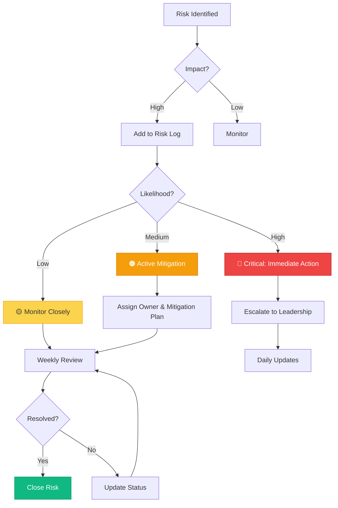

# Risk Mitigation Matrices
**Visual Diagrams for Slides 9 & 18**

---

## Meta Risk Mitigation Matrix (Slide 9)

### Table Format

```
┌─────────────────────────────────────────────────────────────────────┐
│               META — RISKS & MITIGATION STRATEGIES                  │
├──────────────────┬──────────────────────────────────────────────────┤
│                  │                                                  │
│  ADOPTION RISK   │  MITIGATION STRATEGY                             │
│                  │                                                  │
│  Resistance to   │  • Safe listening sessions (no judgment)         │
│  Blueprint       │  • Champions program (30+ advocates)             │
│  system changes  │  • Targeted education (role-specific)            │
│                  │  • Show early wins from pilot teams              │
│  Impact: High    │  • Office hours for Q&A                          │
│  Likelihood: Med │                                                  │
│                  │  Cadence: Weekly listening, monthly reviews      │
│                  │                                                  │
├──────────────────┼──────────────────────────────────────────────────┤
│                  │                                                  │
│  ALIGNMENT RISK  │  MITIGATION STRATEGY                             │
│                  │                                                  │
│  Competing OKRs  │  • Portfolio tracker (work → growth metrics)     │
│  across orgs     │  • Monthly growth reviews with leadership        │
│                  │  • Shared success metrics across Agency,         │
│  Impact: High    │    Blueprint, and Creators teams                 │
│  Likelihood: High│  • Executive sponsors for each workstream        │
│                  │                                                  │
│                  │  Cadence: Monthly portfolio reviews              │
│                  │                                                  │
├──────────────────┼──────────────────────────────────────────────────┤
│                  │                                                  │
│  QUALITY RISK    │  MITIGATION STRATEGY                             │
│                  │                                                  │
│  Inconsistent    │  • Excellence checkpoints (bi-weekly)            │
│  craft across    │  • AI quality guard pilot (automated checks)     │
│  surfaces        │  • Blueprint component review process            │
│                  │  • Design QA checklists                          │
│  Impact: Medium  │  • Cross-pod crits for peer review               │
│  Likelihood: Med │                                                  │
│                  │  Cadence: Weekly crits, bi-weekly checkpoints    │
│                  │                                                  │
├──────────────────┼──────────────────────────────────────────────────┤
│                  │                                                  │
│  TRUST/SAFETY    │  MITIGATION STRATEGY                             │
│                  │                                                  │
│  Rights,         │  • Cross-functional toolkit (Legal, Policy)      │
│  originality,    │  • Governance baked into workflows               │
│  content         │  • Creator rights education for designers        │
│  moderation      │  • Pre-launch safety reviews                     │
│                  │  • Ongoing policy alignment sessions             │
│  Impact: High    │                                                  │
│  Likelihood: Low │  Cadence: Bi-weekly policy syncs                 │
│                  │                                                  │
└──────────────────┴──────────────────────────────────────────────────┘
```

---

### 2x2 Risk Matrix (Impact vs. Likelihood)

```
              HIGH IMPACT
                  │
    ┌─────────────┼─────────────┐
    │             │             │
    │  ALIGNMENT  │  ADOPTION   │
    │    RISK     │    RISK     │
    │             │             │
    │ Monthly     │ Champions + │
    │ reviews     │ education   │
    │             │             │
HIGH├─────────────┼─────────────┤LOW
LIKE│             │             │LIKE
    │  (none)     │  QUALITY    │
    │             │    RISK     │
    │             │             │
    │             │ Excellence  │
    │             │ checkpoints │
    │             │             │
    └─────────────┼─────────────┘
                  │
              LOW IMPACT

Trust/Safety: High Impact, Low Likelihood → Proactive governance
```

---

## Ring Risk Mitigation Matrix (Slide 18)

### 2x2 Grid Format

```
┌─────────────────────────────────────────────────────────────────────┐
│              RING — RISKS & MITIGATION (90 DAYS)                    │
├─────────────────────────────┬───────────────────────────────────────┤
│                             │                                       │
│  EXECUTIVE RISK             │  ADOPTION RISK                        │
│                             │                                       │
│  Risk: Loss of confidence   │  Risk: Teams revert to old ways      │
│  in working model or sprint │  after pilot                          │
│                             │                                       │
│  Mitigation:                │  Mitigation:                          │
│  ✓ Weekly dashboards        │  ✓ Pilot pods (3 teams)              │
│  ✓ Friday leadership        │  ✓ Staged rollout                    │
│    readouts                 │  ✓ Show early wins                   │
│  ✓ Transparent risk log     │  ✓ Integrate into rituals            │
│  ✓ No-surprise policy       │  ✓ Make easy to use (UDB, RASCI)     │
│                             │                                       │
│  Impact: High               │  Impact: Medium                       │
│  Likelihood: Medium         │  Likelihood: Medium                   │
│                             │                                       │
├─────────────────────────────┼───────────────────────────────────────┤
│                             │                                       │
│  MORALE RISK                │  DELIVERY RISK                        │
│                             │                                       │
│  Risk: Burnout from fast    │  Risk: Miss 90-day deadline or       │
│  pace and dual-track work   │  ship incomplete work                 │
│                             │                                       │
│  Mitigation:                │  Mitigation:                          │
│  ✓ Pulse surveys (weekly)   │  ✓ Sprint guardrails (scope)         │
│  ✓ Mentorship pairings      │  ✓ Risk log (updated weekly)         │
│  ✓ Celebrate small wins     │  ✓ Parking lot for future work       │
│  ✓ Protect time off         │  ✓ Weekly milestone tracking         │
│  ✓ Transparent workload     │  ✓ Buffer time (10% per sprint)      │
│                             │                                       │
│  Impact: Medium             │  Impact: High                         │
│  Likelihood: High           │  Likelihood: Medium                   │
│                             │                                       │
└─────────────────────────────┴───────────────────────────────────────┘
```

---

### Risk Heatmap (Color-Coded)

```
┌─────────────────────────────────────────────────────────────────────┐
│                   RING: RISK HEATMAP                                │
├─────────────────────────────────────────────────────────────────────┤
│                                                                     │
│   LIKELIHOOD                                                        │
│      ↑                                                              │
│      │                                                              │
│ HIGH │  ┌──────────────┐  ┌──────────────┐                         │
│      │  │   MORALE     │  │  EXECUTIVE   │                         │
│      │  │   🟡 MEDIUM  │  │  🟠 HIGH     │                         │
│      │  └──────────────┘  └──────────────┘                         │
│      │                                                              │
│  MED │  ┌──────────────┐  ┌──────────────┐                         │
│      │  │   ADOPTION   │  │  DELIVERY    │                         │
│      │  │   🟡 MEDIUM  │  │  🟠 HIGH     │                         │
│      │  └──────────────┘  └──────────────┘                         │
│      │                                                              │
│  LOW │                                                              │
│      │                                                              │
│      └───────────────────────────────────────────→                 │
│                        IMPACT                                       │
│              LOW          MEDIUM          HIGH                      │
│                                                                     │
│  🟢 Low Priority   🟡 Monitor   🟠 Active Mitigation   🔴 Critical  │
└─────────────────────────────────────────────────────────────────────┘

Legend:
  🟢 Green: Low priority (accept or monitor)
  🟡 Yellow: Monitor closely
  🟠 Orange: Active mitigation required
  🔴 Red: Critical — immediate action
```

---

## Weekly Risk Review Template

```
┌─────────────────────────────────────────────────────────────────────┐
│                   WEEKLY RISK REVIEW                                │
│                   Week: __  |  Date: ______                         │
├─────────────────────────────────────────────────────────────────────┤
│                                                                     │
│  Risk            Status    Owner    Last Updated    Next Action     │
│  ──────────────  ────────  ───────  ─────────────  ──────────────  │
│                                                                     │
│  Executive       🟢 Low    PM       Oct 15         Weekly readout   │
│  confidence                                        (Fri)           │
│                                                                     │
│  Adoption        🟡 Monitor Design  Oct 14         Pilot review     │
│  resistance                                        (Mon)           │
│                                                                     │
│  Team morale     🟡 Monitor Ops     Oct 16         Pulse survey     │
│                                                    (Wed)           │
│                                                                     │
│  90-day          🟠 Active  PM       Oct 16         Sprint planning │
│  deadline                                          (Mon)           │
│                                                                     │
│  ──────────────────────────────────────────────────────────────────│
│                                                                     │
│  New Risks This Week:                                               │
│  • None                                                             │
│                                                                     │
│  Risks Closed This Week:                                            │
│  • UDB adoption (pilot successful, rolling out)                     │
│                                                                     │
│  ──────────────────────────────────────────────────────────────────│
│                                                                     │
│  Top 3 Priorities for Next Week:                                    │
│  1. Deliver Sprint 1 (UX) on time                                   │
│  2. Socialize UDB success to 3 additional teams                     │
│  3. Run morale pulse survey                                         │
│                                                                     │
└─────────────────────────────────────────────────────────────────────┘
```

---

## Mitigation Cadence Calendar

```
WEEKLY RITUALS FOR RISK MITIGATION

MONDAY           WEDNESDAY        FRIDAY
  │                  │               │
  ▼                  ▼               ▼
┌────────┐       ┌────────┐     ┌────────┐
│ Sprint │       │  Risk  │     │ Leader │
│Planning│       │  Log   │     │Readout │
│        │       │ Review │     │        │
│ Update │       │        │     │ Share  │
│ risks  │       │ Update │     │ risks  │
│        │       │ status │     │        │
└────────┘       └────────┘     └────────┘

BI-WEEKLY                MONTHLY
    │                       │
    ▼                       ▼
┌────────┐           ┌────────────┐
│ Pulse  │           │Retrospective│
│ Survey │           │            │
│        │           │ Review all │
│ Morale │           │ risks &    │
│ check  │           │ mitigations│
└────────┘           └────────────┘
```

---

## Mermaid Flowchart: Risk Escalation



---

## Slide Layout Recommendations

**Meta (Slide 9):**
- Two-column table (Risk | Mitigation)
- Use subtle color-coding: Red (high impact/likelihood), Yellow (medium), Green (low)
- Include cadence callouts at bottom of each row
- Footer: Visual timeline showing mitigation checkpoints

**Ring (Slide 18):**
- 2x2 grid (Executive, Adoption, Morale, Delivery)
- Each quadrant has risk description + mitigation bullets
- Color-code by severity (see heatmap)
- Clean, scannable layout

**Animation:**
- Quadrants/rows appear sequentially (top-left to bottom-right)
- Mitigation strategies fade in after risk description
- Use color transitions to draw attention to high-priority risks

---

**Export Recommendations:**
- Create in Figma or PowerPoint with clear visual hierarchy
- Use consistent color-coding across all risk visualizations
- Export as PNG (2x) or PDF with editable text
- Keep risk log as live document (update weekly during sprint)
