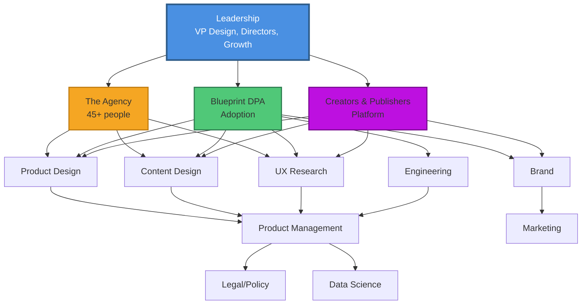
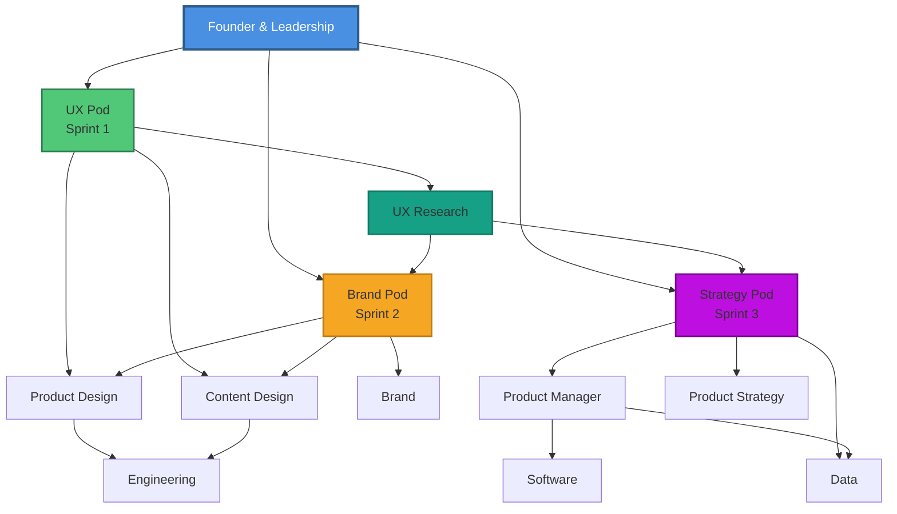

# Stakeholder Network Maps
**Visual Diagrams for Slides 7 & 15**

---

## Meta Stakeholder Network (Slide 7)

### Network Diagram

```
                            ┌────────────────┐
                            │   LEADERSHIP   │
                            │ VP Design      │
                            │ Design Directors│
                            │ Growth Leaders │
                            └────────┬───────┘
                                     │
                    ┌────────────────┼────────────────┐
                    │                │                │
            ┌───────▼─────┐  ┌──────▼──────┐  ┌──────▼──────┐
            │  THE AGENCY │  │  BLUEPRINT  │  │  CREATORS & │
            │             │  │     DPA     │  │ PUBLISHERS  │
            │ 45+ people  │  │  Adoption   │  │  Platform   │
            └───────┬─────┘  └──────┬──────┘  └──────┬──────┘
                    │                │                │
        ┌───────────┼────────────────┼────────────────┼───────────┐
        │           │                │                │           │
   ┌────▼────┐ ┌───▼──────┐  ┌──────▼─────┐  ┌──────▼─────┐ ┌──▼────┐
   │ Product │ │  Content │  │    UX      │  │   Brand    │ │  Eng  │
   │ Design  │ │  Design  │  │  Research  │  │            │ │       │
   └────┬────┘ └───┬──────┘  └──────┬─────┘  └──────┬─────┘ └───┬───┘
        │          │                │                │           │
        └──────────┴────────────────┴────────────────┴───────────┘
                                    │
                    ┌───────────────┼───────────────┐
                    │               │               │
            ┌───────▼──────┐ ┌─────▼─────┐ ┌───────▼────────┐
            │   Product    │ │ Marketing │ │ Legal/Policy   │
            │  Management  │ │           │ │ Data Science   │
            └──────────────┘ └───────────┘ └────────────────┘
```

### Node Legend

```
┌─────────────────────────────────────────────────────────────┐
│                      STAKEHOLDER TYPES                      │
├─────────────────────────────────────────────────────────────┤
│                                                             │
│  🎯 CORE TEAM (Daily collaboration)                        │
│     • Product Design (10+ designers)                        │
│     • Content Design (5+ content designers)                 │
│     • UX Research (5+ researchers)                          │
│     • Engineering (20+ engineers)                           │
│     • Brand (5+ brand designers)                            │
│                                                             │
│  🤝 CROSS-FUNCTIONAL PARTNERS (Weekly/bi-weekly sync)      │
│     • Product Management (10+ PMs)                          │
│     • Marketing (5+ marketers)                              │
│     • Legal/Policy (3+ specialists)                         │
│     • Data Science (5+ analysts)                            │
│                                                             │
│  👔 LEADERSHIP (Bi-weekly/monthly reviews)                 │
│     • VP Design                                             │
│     • Design Directors (3+)                                 │
│     • Growth Leaders (5+)                                   │
│                                                             │
│  TOTAL: 10+ functions, 45+ Agency headcount                │
│                                                             │
└─────────────────────────────────────────────────────────────┘
```

### Circular Network View (Alternative Layout)

```
                         LEADERSHIP
                         VP Design
                      Design Directors
                      Growth Leaders
                            │
                ┌───────────┼───────────┐
                │           │           │
           THE AGENCY   BLUEPRINT   CREATORS
           (45+ people)    DPA      PUBLISHERS
                │           │           │
    ┌───────────┴───────────┴───────────┴───────────┐
    │                                               │
PRODUCT DESIGN ─────── UX RESEARCH ─────── CONTENT DESIGN
    │                       │                       │
    │                   BRAND ─────────── ENGINEERING
    │                       │                       │
    └───────────────────────┴───────────────────────┘
                            │
            ┌───────────────┼───────────────┐
            │               │               │
    PRODUCT MGMT       MARKETING      LEGAL/POLICY
                                      DATA SCIENCE
```

---

## Ring Stakeholder Network (Slide 15)

### Circular Pod Structure

```
╔═══════════════════════════════════════════════════════════════════╗
║                  RING STAKEHOLDER NETWORK                         ║
╠═══════════════════════════════════════════════════════════════════╣
║                                                                   ║
║                        ┌─────────────┐                            ║
║                        │   FOUNDER   │                            ║
║                        │   OPS/DESIGN│                            ║
║                        │  LEADERSHIP │                            ║
║                        └──────┬──────┘                            ║
║                               │                                   ║
║               ┌───────────────┼───────────────┐                   ║
║               │               │               │                   ║
║          ┌────▼────┐     ┌───▼───┐      ┌───▼────┐              ║
║          │ UX POD  │     │BRAND  │      │ STRAT  │              ║
║          │ SPRINT 1│     │POD    │      │ POD    │              ║
║          └────┬────┘     │SPRINT2│      │SPRINT 3│              ║
║               │          └───┬───┘      └───┬────┘              ║
║               │              │              │                    ║
║    ┌──────────┼──────────────┼──────────────┼──────────┐        ║
║    │          │              │              │          │        ║
║ ┌──▼───┐  ┌──▼───┐      ┌───▼──┐      ┌────▼──┐  ┌───▼──┐     ║
║ │Product│ │  UX  │      │Content│     │  Eng  │  │ PM   │     ║
║ │Design │ │Research│    │Design │     │       │  │      │     ║
║ └──┬────┘ └──┬───┘      └───┬──┘      └────┬──┘  └───┬──┘     ║
║    │         │              │              │         │         ║
║    └─────────┴──────────────┴──────────────┴─────────┘         ║
║                             │                                   ║
║              ┌──────────────┼──────────────┐                    ║
║              │              │              │                    ║
║         ┌────▼────┐    ┌───▼────┐    ┌────▼─────┐             ║
║         │Software │    │  Data  │    │ Product  │             ║
║         │         │    │        │    │ Strategy │             ║
║         └─────────┘    └────────┘    └──────────┘             ║
║                                                                 ║
╚═══════════════════════════════════════════════════════════════════╝
```

### Pod Composition Table

```
┌─────────────────────────────────────────────────────────────────┐
│              RING: CROSS-FUNCTIONAL POD STRUCTURE               │
├─────────────────────────────────────────────────────────────────┤
│                                                                 │
│  SPRINT 1: UX POD (Weeks 0-4)                                  │
│  ────────────────────────────────────────────────────────────  │
│  Lead: Product Design                                           │
│  Core: UX Research, Content Design                              │
│  Support: Engineering (technical feasibility)                   │
│  Consulted: PM, Brand                                           │
│                                                                 │
│  SPRINT 2: BRAND POD (Weeks 4-8)                               │
│  ────────────────────────────────────────────────────────────  │
│  Lead: Brand, Content Design                                    │
│  Core: Product Design (visual integration)                      │
│  Support: UX Research (concept testing)                         │
│  Consulted: PM, Engineering                                     │
│                                                                 │
│  SPRINT 3: STRATEGY POD (Weeks 8-12)                           │
│  ────────────────────────────────────────────────────────────  │
│  Lead: Product Manager                                          │
│  Core: Product Strategy, Data                                   │
│  Support: Product Design, UX Research                           │
│  Consulted: Engineering, Brand                                  │
│                                                                 │
│  CONTINUOUS THROUGHLINE                                         │
│  ────────────────────────────────────────────────────────────  │
│  UX Research: Embedded across all 3 sprints (Weeks 0-12)       │
│                                                                 │
└─────────────────────────────────────────────────────────────────┘
```

### Workshop Participation Matrix

```
RING: 20 WORKSHOPS ACROSS 90 DAYS

         │ UX   │ Brand │ Strategy │ Total
─────────┼──────┼───────┼──────────┼──────
Product  │ ████ │ ███   │ ██       │  9
Design   │      │       │          │
─────────┼──────┼───────┼──────────┼──────
UX       │ ████ │ ███   │ ███      │ 10
Research │      │       │          │
─────────┼──────┼───────┼──────────┼──────
Content  │ ███  │ ████  │ ██       │  9
Design   │      │       │          │
─────────┼──────┼───────┼──────────┼──────
Brand    │ ██   │ ████  │ █        │  7
─────────┼──────┼───────┼──────────┼──────
Eng      │ ███  │ ██    │ ███      │  8
─────────┼──────┼───────┼──────────┼──────
PM       │ ██   │ ██    │ ████     │  8
─────────┼──────┼───────┼──────────┼──────
Product  │ █    │ █     │ ████     │  6
Strategy │      │       │          │
─────────┼──────┼───────┼──────────┼──────
Data     │ █    │ █     │ ███      │  5
─────────┴──────┴───────┴──────────┴──────

Each █ = ~2-3 workshops
```

---

## Mermaid Network Diagrams

### Meta Network (Mermaid)



### Ring Network (Mermaid)



---

## Slide Layout Recommendations

**Meta (Slide 7):**
- Network map with nodes and connecting lines
- Legend by function (Core, Partners, Leadership)
- Use different node sizes: Leadership (largest), Core (medium), Partners (small)
- Color-code by workstream: Agency (orange), Blueprint (green), Creators (purple)

**Ring (Slide 15):**
- Circular org map showing pods
- Place Founder/Leadership at center
- Three pods radiating out (UX, Brand, Strategy)
- UXR shown as continuous throughline connecting all pods
- Use consistent colors across all Ring slides

---

## Visual Design Tips

1. **Node Size:** Leadership > Core Team > Partners
2. **Line Weight:** Strong collaboration (thick) > Occasional sync (thin)
3. **Colors:** Consistent with timeline and other diagrams
4. **Labels:** Short, readable (use acronyms when needed)
5. **White Space:** Don't overcrowd; clarity over completeness

---

**Export Recommendations:**
- Create in Figma, Miro, or specialized network diagramming tools
- Use animation: Nodes appear in layers (Leadership → Core → Partners)
- Export as SVG for scalability or PNG at 2x
- Keep editable source for updates
